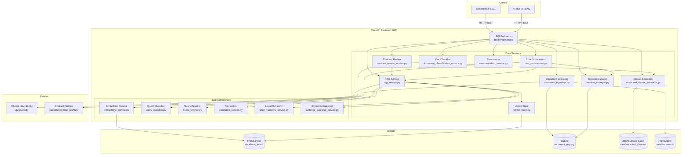
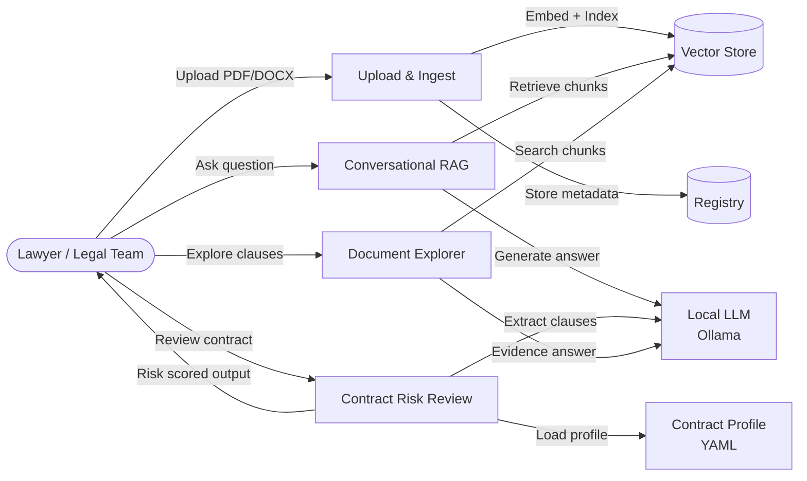

# Architect Report — Legal Document LLM-Powered Pipeline

---

## Simple Summary

A **legal AI assistant** that lets lawyers and legal teams upload PDF/DOCX contracts or case files, then ask natural-language questions about them, get structured risk analyses, extract clauses, compare contracts, and summarize case documents — all powered by a local LLM (Ollama) and multilingual semantic search.

---

## Backend

**Technical:**
FastAPI server (`backend/main.py`) exposes 20+ REST endpoints. At startup it initialises ~45 singleton service instances — FAISS vector store, embedding model (sentence-transformers), Ollama LLM client, SQLite document registry, and specialised services for RAG, clause extraction, contract review, chat sessions, summarisation, and document classification. Document ingestion parses PDF/DOCX (with OCR fallback via Tesseract), chunks text into 700-token windows with 100-token overlap, embeds each chunk with a multilingual MiniLM model, and upserts into FAISS. Retrieval is handled by `rag_service.py`, which performs cosine similarity search, applies legal-hierarchy boosting, optionally translates Arabic queries to English, and feeds ranked chunks as context into Ollama. Contract review (`contract_review_service.py`) loads a YAML profile for the contract type, runs structured clause extraction, maps each clause to risk severity via `risk_explanations.yaml`, and returns a structured `ContractReviewResponse`. Conversational state is managed by `session_manager.py` + `chat_orchestrator.py`, storing messages in SQLite and compressing history with `conversation_summarizer.py`.

**Simple:**
It's the brain. It reads uploaded documents, turns them into searchable vectors, answers questions using a local AI model, flags risky contract clauses, and keeps track of ongoing conversations.

---

## Frontend

**Technical:**
Two UIs run in parallel:
- **Streamlit** (`frontend/app.py`, port 8501): A Python-native UI with 4 pages — Contract Review, Document Explorer, Upload Document, About. Communicates with the backend exclusively via HTTP (`requests`), calls helpers like `upload_document()`, `search_documents()`, `extract_clauses()`, `compare_contracts()`, `summarize_case_file()`. Handles SSE-style streaming responses and renders citations with custom CSS.
- **Next.js** (`frontend/young-counsel-ui/`, port 3000): A React/Tailwind web app with pages and components directory, intended as the production-grade interface.

**Simple:**
Two websites talk to the backend — a quick Python one (Streamlit) for prototyping, and a polished React one for end users.

---

## Database / Storage

**Technical:**
Three persistence mechanisms running side-by-side:
1. **FAISS** (`data/faiss_index/`): In-process vector index (dim=384) storing embedded document chunks. Managed by `vector_store.py`; supports upsert, delete, cosine similarity search.
2. **SQLite** (managed by `document_registry.py`): Stores document metadata (filename, upload timestamp, chunk count, classification), session messages, and ingestion state.
3. **JSON files** (`data/extracted_clauses/`): Extracted clause objects with versioning, managed by `extracted_clause_store.py`. Allows clause retrieval without re-running LLM extraction.
4. **File system** (`data/documents/`): Raw uploaded files (PDF/DOCX).

**Simple:**
Documents are stored as files. Their text is stored as searchable vectors in FAISS. Metadata, chat history, and extracted clauses live in SQLite and JSON files on disk.

---

## Architectural Diagram

---

## High-Level Diagram

---

## Low-Level Diagram

```mermaid
graph TD
    subgraph Upload Flow
        U1[POST /api/upload\nmain.py] --> U2[parse_document\nfile_parser.py]
        U2 --> U3[chunk_document\nchunking.py]
        U3 --> U4[classify_document\ndocument_classification_service.py]
        U4 --> U5[embed_chunks\nembedding_service.py]
        U5 --> U6[upsert_vectors\nvector_store.py → FAISS]
        U6 --> U7[register_document\ndocument_registry.py → SQLite]
    end

    subgraph RAG Query Flow
        R1[POST /api/search\nmain.py] --> R2[classify_query\nquery_classifier.py]
        R2 --> R3[rewrite_query\nquery_rewriter.py]
        R3 --> R4{Arabic?}
        R4 -->|Yes| R5[translate_query\ntranslation_service.py]
        R4 -->|No| R6[embed_query\nembedding_service.py]
        R5 --> R6
        R6 --> R7[similarity_search\nvector_store.py]
        R7 --> R8[rank + boost\nlegal_hierarchy_service.py]
        R8 --> R9[guardrail_check\nevidence_guardrail_service.py]
        R9 --> R10[build_prompt + call_LLM\nrag_service.py → Ollama]
        R10 --> R11[format_response\nAnswerResponse]
    end

    subgraph Contract Review Flow
        C1[POST /api/contract-review\nmain.py] --> C2[load_profile\ncontract_profile_loader.py → YAML]
        C2 --> C3[extract_clauses\nstructured_clause_extraction.py → Ollama]
        C3 --> C4[store_clauses\nextracted_clause_store.py → JSON]
        C4 --> C5[map_risks\ncontract_review_service.py + risk_explanations.yaml]
        C5 --> C6[generate_executive_summary\nOllama]
        C6 --> C7[return ContractReviewResponse]
    end

    subgraph Chat Session Flow
        S1[POST /api/chat/session\nmain.py] --> S2[create_session\nsession_manager.py → SQLite]
        S2 --> S3[POST /api/chat/session_id]
        S3 --> S4[classify_intent\nquery_classifier.py]
        S4 --> S5[orchestrate\nchat_orchestrator.py]
        S5 --> S6[retrieve_context\nrag_service.py]
        S6 --> S7[compress_history\nconversation_summarizer.py]
        S7 --> S8[call_LLM\nOllama]
        S8 --> S9[store_message\nsession_manager.py → SQLite]
        S9 --> S10[return ChatMessageResponse]
    end
```

---

## Data / Query Flow Diagrams

### Flow 1: Document Upload & Ingestion

| Step | File | Function | Purpose |
|------|------|----------|---------|
| 1 | `backend/main.py` | `upload_document()` endpoint | Receives multipart file, acquires upload lock |
| 2 | `backend/utils/file_parser.py` | `parse_document()` | Extracts raw text from PDF/DOCX; falls back to Tesseract OCR |
| 3 | `backend/utils/ocr_cleanup.py` | `normalize_ocr_text()` | Strips OCR artifacts, normalises Arabic/English whitespace |
| 4 | `backend/utils/chunking.py` | `chunk_document()` | Splits text into 700-token windows, 100-token overlap, clause-aware |
| 5 | `backend/services/document_classification_service.py` | `classify_document()` | 2-stage: Ollama heuristic → DistilBERT fallback; returns contract type |
| 6 | `backend/services/embedding_service.py` | `embed_texts()` | Encodes chunks with `paraphrase-multilingual-MiniLM-L12-v2` (dim=384) |
| 7 | `backend/services/vector_store.py` | `upsert_chunks()` | Adds vectors + metadata to FAISS index; persists to disk |
| 8 | `backend/services/document_registry.py` | `register_document()` | Writes doc metadata (id, filename, chunk count, classification) to SQLite |

---

### Flow 2: RAG Semantic Search

| Step | File | Function | Purpose |
|------|------|----------|---------|
| 1 | `backend/main.py` | `search()` endpoint | Receives query + optional filters |
| 2 | `backend/services/query_classifier.py` | `classify_query()` | Identifies query types (factual, risk, clause) and scope topics |
| 3 | `backend/services/query_rewriter.py` | `rewrite_query()` | Expands legal abbreviations, normalises query wording |
| 4 | `backend/services/translation_service.py` | `translate_to_english()` | Translates Arabic queries (deep-translator) if detected |
| 5 | `backend/services/embedding_service.py` | `embed_texts()` | Embeds rewritten query into vector space |
| 6 | `backend/services/vector_store.py` | `similarity_search()` | Cosine search in FAISS, returns top-K=5 chunks |
| 7 | `backend/services/legal_hierarchy_service.py` | `rerank_by_hierarchy()` | Boosts law > contract > policy chunks; filters by threshold 0.65 |
| 8 | `backend/services/evidence_guardrail_service.py` | `check_guardrails()` | Rejects off-topic or low-confidence retrievals |
| 9 | `backend/services/rag_service.py` | `build_prompt()` → `call_llm()` | Assembles system + context prompt; calls Ollama `qwen2.5:3b` |
| 10 | `backend/main.py` | response serialisation | Returns `AnswerResponse` with answer, citations, confidence |

---

### Flow 3: Contract Risk Review

| Step | File | Function | Purpose |
|------|------|----------|---------|
| 1 | `backend/main.py` | `contract_review()` endpoint | Receives `ContractReviewRequest` (contract_id, type, jurisdiction) |
| 2 | `backend/services/contract_profile_loader.py` | `load_profile()` | Loads YAML for type (nda/msa/employment): expected clauses, risk weights |
| 3 | `backend/services/retrieval_router.py` | `route_retrieval()` | Selects retrieval strategy (clause-specific vs full-doc scan) |
| 4 | `backend/services/structured_clause_extraction.py` | `extract_clauses()` | Prompts Ollama to identify & extract clauses with verbatim evidence |
| 5 | `backend/services/extracted_clause_store.py` | `store_clauses()` | Saves extracted clause JSON with versioning to `data/extracted_clauses/` |
| 6 | `backend/services/contract_review_service.py` | `score_risks()` | Maps clause presence/absence + profile weights → `RiskItem` list |
| 7 | `backend/contract_profiles/risk_explanations.yaml` | _(data)_ | Provides human-readable reason + recommendation per clause/status/severity |
| 8 | `backend/services/contract_review_service.py` | `generate_executive_summary()` | Calls Ollama to produce bullet-point executive summary |
| 9 | `backend/models/contract_review.py` | `ContractReviewResponse` | Serialises risks, evidence blocks, summary into API response |

---

### Flow 4: Conversational Chat Session

| Step | File | Function | Purpose |
|------|------|----------|---------|
| 1 | `backend/main.py` | `create_session()` endpoint | Creates `ChatSession` record in SQLite, returns session_id |
| 2 | `backend/main.py` | `chat_message()` endpoint | Receives user message + session_id |
| 3 | `backend/services/query_classifier.py` | `classify_query()` | Identifies intent to route to correct sub-service |
| 4 | `backend/services/chat_orchestrator.py` | `orchestrate()` | Decides: direct RAG, clause lookup, or exploratory answer |
| 5 | `backend/services/session_manager.py` | `get_history()` | Loads previous messages from SQLite |
| 6 | `backend/services/conversation_summarizer.py` | `compress_history()` | Summarises old turns to keep prompt within token budget |
| 7 | `backend/services/rag_service.py` | `retrieve_and_answer()` | Retrieves context chunks, constructs prompt, calls Ollama |
| 8 | `backend/services/session_manager.py` | `append_message()` | Persists assistant reply + retrieval trace to SQLite |
| 9 | `backend/models/session.py` | `ChatMessageResponse` | Returns reply, citations, retrieval trace to frontend |
