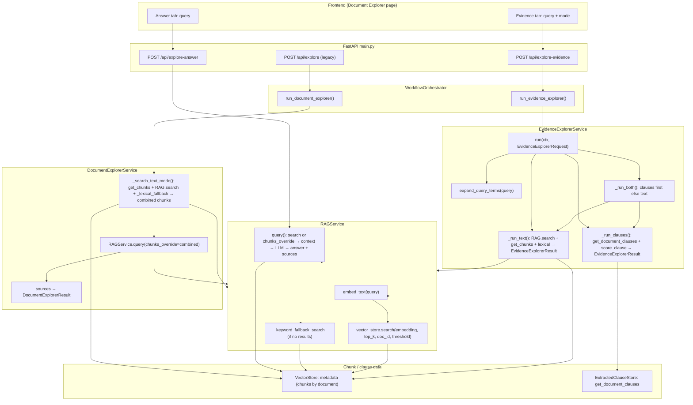

# Document Explorer – Workflow & Data Flow

This document describes the Document Explorer workflow and how data/chunks flow through the system. There are **three** API entry points; the UI uses the two new ones (Evidence + Answer). The legacy `/api/explore` still runs the old “answer + evidence” flow.

---

## High-Level Entry Points

```
┌─────────────────────────────────────────────────────────────────────────────────┐
│                         DOCUMENT EXPLORER ENTRY POINTS                            │
├─────────────────────────────────────────────────────────────────────────────────┤
│  UI "Evidence" tab    →  POST /api/explore-evidence  →  EvidenceExplorerService  │
│  UI "Answer" tab      →  POST /api/explore-answer    →  RAGService.query        │
│  Legacy               →  POST /api/explore            →  DocumentExplorerService  │
└─────────────────────────────────────────────────────────────────────────────────┘
```

---

## 1. Evidence Explorer Flow (`/api/explore-evidence`) – No LLM

**Request:** `document_id`, `query`, `top_k`, `mode` (text | clauses | both)

```
┌──────────────┐     POST /api/explore-evidence      ┌─────────────────────────┐
│   Frontend   │ ──────────────────────────────────► │  main.explore_evidence  │
└──────────────┘                                      └───────────┬─────────────┘
                                                                  │
                                                                  ▼
                                                    ┌─────────────────────────────┐
                                                    │ WorkflowOrchestrator        │
                                                    │ .run_evidence_explorer()    │
                                                    │ → EvidenceExplorerRequest   │
                                                    └───────────┬─────────────────┘
                                                                  │
                                                                  ▼
┌─────────────────────────────────────────────────────────────────────────────────────────────┐
│                    EvidenceExplorerService.run(ctx, request)                                  │
│  • expand_query_terms(query) → List[str]   (normalize_for_match + QUERY_FAMILIES)             │
│  • detect_ocr_noise(query)                                                                   │
│  • Branch by mode: "both" | "clauses" | "text"                                               │
└─────────────────────────────────────────────────────────────────────────────────────────────┘
         │
         ├── mode = "both" ──────► _run_both()
         │                              │
         │                              ├─► _run_clauses() ──► if results: return clause_response
         │                              └─► else: _run_text()
         │
         ├── mode = "clauses" ───► _run_clauses()
         │
         └── mode = "text" ──────► _run_text()
```

### Chunk/Data Flow by Mode

**Text mode (`_run_text`):**

- **Query** → `expand_query_terms(query)` → **expanded_keywords** (list of strings).
- **RAGService.search**(query, top_k, document_id_filter, similarity_threshold=0.45):
  - `embedding_service.embed_text(query)` → **query_embedding**
  - **vector_store.search**(query_embedding, top_k, document_id_filter, threshold) → **semantic_results** (list of chunk dicts: text, page_number, chunk_index, score, document_id, …).
- If no semantic results: **vector_store.get_chunks_by_document(document_id)** → **all_chunks**; for each chunk, **normalize_for_match(chunk["text"])** and match **expanded_keywords** → **lexical_results** (chunk dicts + score=1.0, lexical_match=True).
- **combined** = union(semantic_results, lexical_results), sort by score, cap top_k.
- Each combined chunk dict → **EvidenceExplorerResult**(text_snippet=truncated text, page_number, chunk_index, score, source_type="chunk") → **EvidenceExplorerResponse**(status, results, reason, debug).

**Clauses mode (`_run_clauses`):**

- **ExtractedClauseStore.get_document_clauses(document_id)** → **clauses** (list of dicts: clause_heading, verbatim_text, page_start, page_end, clause_id).
- For each clause: **score_clause(clause, expanded_keywords)** uses **normalize_for_match** on heading and verbatim_text, counts heading/body hits → **score**; keep if heading_hits ≥ 1 or score > 0.
- Sorted matches (by score), capped top_k → each clause → **EvidenceExplorerResult**(text_snippet=verbatim truncated, page_number=page_start, source_type="clause", clause_id, page_end) → **EvidenceExplorerResponse**.

**Both mode:** Run **clauses** first; if **clause_response.results** non-empty, return it; else run **text** as above.

**Response:** `{ status, results[], reason, debug, workflow_id }` — **no** `answer` field. Chunks/clauses only become **results[]** (snippets + metadata).

---

## 2. RAG Answer Explorer Flow (`/api/explore-answer`)

**Request:** `document_id`, `query`, `top_k`, `response_language` (optional)

```
┌──────────────┐     POST /api/explore-answer       ┌─────────────────────┐
│   Frontend   │ ─────────────────────────────────► │ main.explore_answer  │
└──────────────┘                                    └──────────┬──────────┘
                                                               │
                                                               ▼
                                                    ┌──────────────────────┐
                                                    │ RAGService.query(    │
                                                    │   query,             │
                                                    │   document_id_filter │
                                                    │   generate_response  │
                                                    │ )                    │
                                                    └──────────┬───────────┘
                                                               │
         ┌────────────────────────────────────────────────────┼────────────────────────────────────────────────────┐
         │                                                     ▼                                                     │
         │  (no chunks_override)  →  clause_store.get_candidate_clauses(document_id)  →  structured_clauses       │
         │                            RAGService.search(query, top_k, document_id_filter)  →  chunks                 │
         │                            optional: _keyword_fallback_search if no chunks                              │
         │                                                     │                                                     │
         │                                                     ▼                                                     │
         │                            _build_context(chunks) or _build_context_from_clauses(structured_clauses)     │
         │                            _build_legal_prompt(query, context, ...)                                       │
         │                            ollama_client.generate(prompt)  →  answer                                      │
         │                            _format_sources_enhanced(chunks)  →  sources                                  │
         │                                                     │                                                     │
         └─────────────────────────────────────────────────────┼─────────────────────────────────────────────────────┘
                                                               ▼
                                                    Response: { status, answer, confidence, sources[], citation }
```

**Chunk flow:** Chunks come from **RAGService.search** (embed → vector_store.search / search_with_priority, optional keyword fallback) or from **ClauseStore**. Those chunks (or clause-based context) feed **context** → **prompt** → **LLM** → **answer**. The same chunks are formatted as **sources** (text, page_number, document_id, score, citation, etc.) and returned with the answer.

---

## 3. Legacy Document Explorer Flow (`/api/explore`)

**Request:** `document_id`, `query`, `top_k`, `mode` (text | clauses)

```
┌──────────────┐     POST /api/explore              ┌─────────────────────────┐
│   Caller     │ ─────────────────────────────────► │ main.document_explorer  │
└──────────────┘                                    └───────────┬─────────────┘
                                                                 │
                                                                 ▼
                                                    ┌─────────────────────────────┐
                                                    │ WorkflowOrchestrator        │
                                                    │ .run_document_explorer()   │
                                                    │ → DocumentExplorerRequest   │
                                                    └───────────┬────────────────┘
                                                                 │
                                                                 ▼
┌─────────────────────────────────────────────────────────────────────────────────────────────┐
│                    DocumentExplorerService.run(ctx, request)                                  │
│  (Currently both modes use text search only; mode is only logged.)                            │
└─────────────────────────────────────────────────────────────────────────────────────────────┘
         │
         ▼
  _search_text_mode(document_id, query)
         │
         ├─► _lexical_keywords(query)  →  keywords (normalize_for_match + termination family)
         ├─► vector_store.get_chunks_by_document(document_id)  →  chunks (all chunk dicts)
         ├─► RAGService.search(query, top_k, document_id_filter, similarity_threshold=None)
         │        → semantic_results (chunk dicts)
         ├─► _lexical_fallback(chunks, keywords)  →  lexical_results (chunk dicts, score=1.0)
         ├─► combined = union(lexical_results, semantic_results), sort by score, cap top_k
         └─► search_result = { "results": combined, "semantic": n, "lexical": m }
         │
         ├─► if combined empty: DocumentExplorerResponse(status="not_found", results=[], reason=...)
         │
         └─► else:
                  RAGService.query(query, document_id_filter, chunks_override=combined)
                        │
                        ├─► Uses combined chunks as context (no new search)
                        ├─► _build_context(chunks)  →  context string
                        ├─► _build_legal_prompt(query, context, ...)  →  prompt
                        ├─► ollama_client.generate(prompt)  →  answer
                        └─► sources = _format_sources_enhanced(chunks)
                        │
                  DocumentExplorerResponse(answer, status, confidence, results=DocumentExplorerResult from sources)
```

**Chunk flow:** **VectorStore.get_chunks_by_document** yields the full list of **chunks** for the document. **RAGService.search** (no threshold) returns **semantic_results** (chunk dicts). **_lexical_fallback(chunks, keywords)** filters **chunks** by keyword match → **lexical_results**. **combined** = merged, sorted, capped chunk list. **combined** is passed as **chunks_override** into **RAGService.query** → used as **context** and for **sources**; LLM produces **answer**. **sources** (from those same chunks) are turned into **DocumentExplorerResult** (snippet, page, score, etc.) and returned with **answer**.

---

## 4. Mermaid: All Three Flows



---

## Summary Table

| Path | Entry | Chunk source | Chunk flow | Output |
|------|--------|--------------|------------|--------|
| **Evidence (text)** | `/api/explore-evidence` mode=text | VectorStore (search + get_chunks_by_document) | query → expand_query_terms → RAG.search(threshold 0.45) → optional lexical over get_chunks → combined → EvidenceExplorerResult[] | status, results[], reason, debug (no answer) |
| **Evidence (clauses)** | `/api/explore-evidence` mode=clauses | ExtractedClauseStore.get_document_clauses | clauses → score_clause(normalize, expanded_keywords) → EvidenceExplorerResult[] | status, results[], reason, debug (no answer) |
| **Evidence (both)** | `/api/explore-evidence` mode=both | Clauses then VectorStore | _run_clauses; if empty → _run_text (same as text row) | status, results[], reason, debug (no answer) |
| **Answer** | `/api/explore-answer` | RAGService.search / ClauseStore / keyword fallback | search → chunks → context → LLM → answer; chunks → sources[] | status, answer, confidence, sources[], citation |
| **Legacy** | `/api/explore` | VectorStore.get_chunks + RAG.search + lexical | get_chunks + search + lexical_fallback → combined → RAG.query(chunks_override) → context + LLM → answer; same chunks → DocumentExplorerResult[] | answer, results[], status, confidence, citation, debug |

---

## Key Files

- **Endpoints:** `backend/main.py` — `explore_evidence`, `explore_answer`, `document_explorer`
- **Orchestration:** `backend/services/workflow_orchestrator.py` — `run_evidence_explorer`, `run_document_explorer`
- **Evidence-only:** `backend/services/evidence_explorer_service.py` — modes text/clauses/both, expand_query_terms, score_clause
- **Legacy answer+evidence:** `backend/services/document_explorer_service.py` — _search_text_mode, RAG.query(chunks_override)
- **Retrieval:** `backend/services/rag_service.py` — search, query; `backend/services/vector_store.py` — search, get_chunks_by_document
- **Clauses:** `backend/services/extracted_clause_store.py` — get_document_clauses
- **Normalization:** `backend/services/text_normalizer.py` — normalize_for_match, detect_ocr_noise
